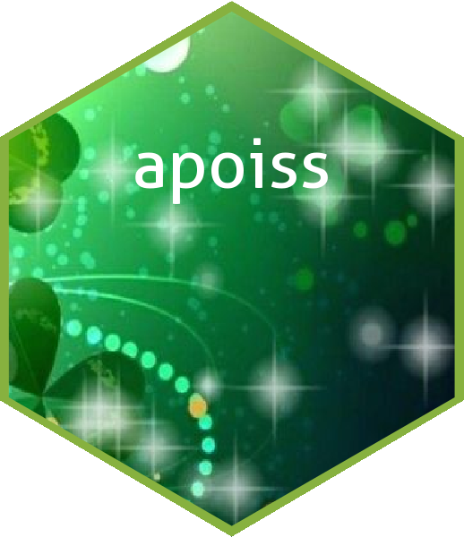

<!-- PROJECT SHIELDS -->
<!--
*** See the bottom of this document for the declaration of the reference variables
*** for contributors-url, forks-url, etc. This is an optional, concise syntax you may use.
*** https://www.markdownguide.org/basic-syntax/#reference-style-links
-->
[![Contributors][contributors-shield]][contributors-url]
[![Forks][forks-shield]][forks-url]
[![Stargazers][stars-shield]][stars-url]
[![Issues][issues-shield]][issues-url]
[![MIT License][license-shield]][license-url]
[![LinkedIn][linkedin-shield]][linkedin-url]


<!-- PROJECT LOGO -->


<p align="center">
  <h3 align="center">apoiss</h3>

  <p align="center">
    Area-level Poisson mixed models
    <br />
    <a href="https://github.com/MBoubeta/apoiss"><strong>Explore the docs »</strong></a>
    <br />
    <br />
    <a href="https://github.com/MBoubeta/apoiss">View Demo</a>
    ·
    <a href="https://github.com/MBoubeta/apoiss">Report Bug</a>
    ·
    <a href="https://github.com/MBoubeta/apoiss">Request Feature</a>
  </p>
</p>


<!-- TABLE OF CONTENTS -->
<details open="open">
  <summary>Table of Contents</summary>
  <ol>
    <li>
      <a href="#about-the-project">About The Project</a>
       <ul>
        <li><a href="#project-structure">Project structure</a></li>
      </ul>
    </li>
    <li>
      <a href="#getting-started">Getting Started</a>
      <ul>
        <li><a href="#installation">Installation</a></li>
      </ul>
    </li>
  </ol>
</details>


<!-- ABOUT THE PROJECT -->
## About The Project 📚

Area-level Poisson mixed models are useful tools for estimating discrete response variables in small areas since they can capture part of the variability not collected by the fixed effects.

This package provides an implementation of the theoretical estimators obtained in the thesis [Poisson mixed models: Applications to Small Area Data](https://ruc.udc.es/dspace/handle/2183/19275). More specifically, *apoiss* contains an implementation of the Method of Moments (MM) for the model paramaters and the Empirical Best Predictor (EBP) for estimating count indicators under the area-level Poisson mixed model.

### Project structure

    ├── docs
    │
    ├── R
    │   │
    |   ├── apoiss-MM-fitting-algorithm.R
    │   │
    |   ├── apoiss-PQL-fitting-algorithm.R
    │   │
    |   ├── apoiss-predictors.R
    │   │
    │   └── metrics.R
    |
    ├── simulations 
    │   │  
    │   └── apoiss
    │       |
    │       ├── sim1.R
    │       |
    │       └── sim2.R
    │
    └── README.md


## Getting Started 

Some instructions are given to configure and execute your project locally. To get a local copy up and running follow these simple example steps.

### Installation ⚙️

Development version:

```sh
# install.packages("devtools")
devtools::install_github("MBoubeta/apoiss")
```

<!-- MARKDOWN LINKS & IMAGES -->
<!-- https://www.markdownguide.org/basic-syntax/#reference-style-links -->
[contributors-shield]: https://img.shields.io/github/contributors/MBoubeta/apoiss.svg?style=for-the-badge
[contributors-url]: https://github.com/MBoubeta/apoiss/graphs/contributors
[forks-shield]: https://img.shields.io/github/forks/MBoubeta/apoiss.svg?style=for-the-badge
[forks-url]: https://github.com/MBoubeta/apoiss/network/members
[stars-shield]: https://img.shields.io/github/stars/MBoubeta/apoiss.svg?style=for-the-badge
[stars-url]: https://github.com/MBoubeta/apoiss/stargazers
[issues-shield]: https://img.shields.io/github/issues/MBoubeta/apoiss.svg?style=for-the-badge
[issues-url]: https://github.com/MBoubeta/apoiss/issues
[license-shield]: https://img.shields.io/github/license/MBoubeta/apoiss.svg?style=for-the-badge
[license-url]: https://github.com/MBoubeta/apoiss/blob/master/LICENSE.txt
[linkedin-shield]: https://img.shields.io/badge/-LinkedIn-black.svg?style=for-the-badge&logo=linkedin&colorB=555
[linkedin-url]: https://www.linkedin.com/in/miguel-boubeta-martinez/